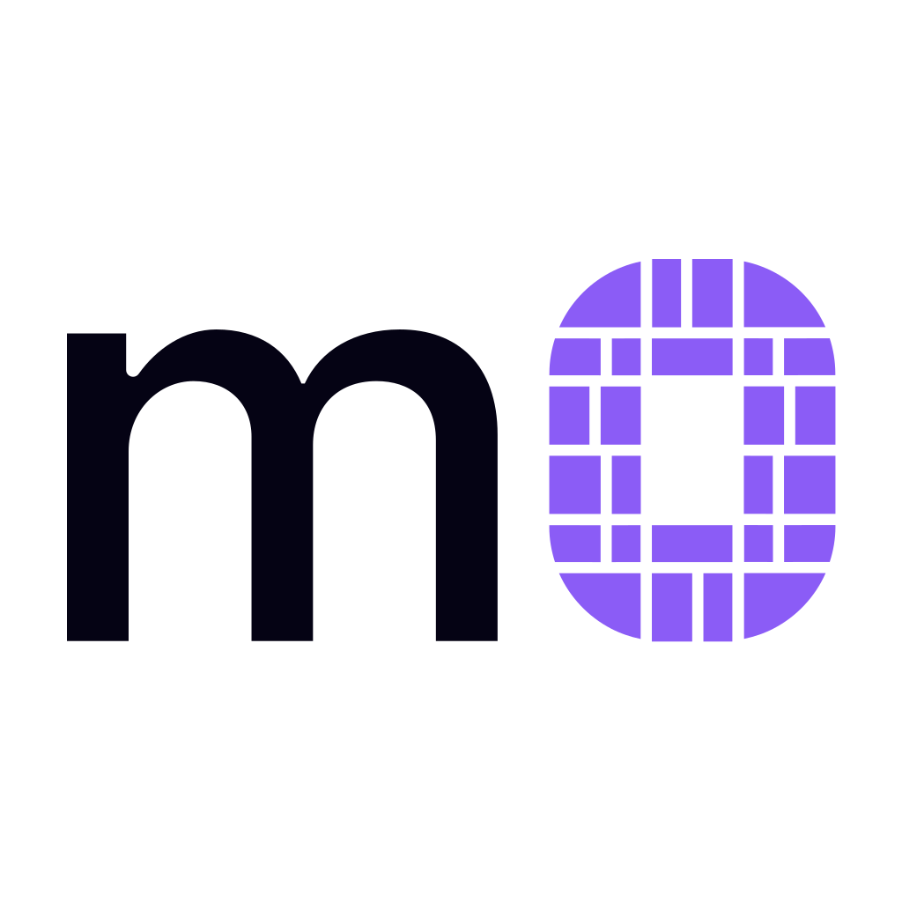

# File formats

Seven file types carry m0 around. Five belong to the language and live in this repo, in
[`@m0saic/dsl-file-formats`](./packages/dsl-file-formats). Two belong to
[m0saic](https://github.com/m0saic-project/m0saic), the video compiler, and sit below the line
because they come up in the same breath.

## The m0 language

<table>
  <tr>
    <th width="10%"></th>
    <th width="13%" align="left">Extension</th>
    <th width="57%" align="left">What it is</th>
    <th width="20%" align="left">Defined in</th>
  </tr>
  <tr>
    <td align="center"></td>
    <td><code>.m0</code></td>
    <td>the layout string and its canvas size, as text: a few <code>#</code> header lines, a blank line, the m0 string. Small, durable, diff-friendly.</td>
    <td><a href="./packages/dsl-file-formats/src/m0"><code>@m0saic/dsl-file-formats</code></a></td>
  </tr>
  <tr>
    <td align="center"></td>
    <td><code>.m0c</code></td>
    <td>m0 with context, as JSON: the string plus any of labels, masks, fills, insets, rank sets, a background, a reference image and agent notes, each keyed by stable key. Every part of the context is optional; it only makes the layout more descriptive.</td>
    <td><a href="./packages/dsl-file-formats/src/m0c"><code>@m0saic/dsl-file-formats</code></a></td>
  </tr>
  <tr>
    <td align="center"></td>
    <td><code>.m0g</code></td>
    <td>a m0saic golden, or "mogging": a <code>.m0c</code> that has been signed off as tried-and-true, so it mogs the other layouts. Same shape and same parser, with <code>format: "m0g"</code>, a <code>gold</code> block for when it was promoted and by whom, and by convention a <code>#mogging</code> first line. What earns the promotion is still open.</td>
    <td><a href="./packages/dsl-file-formats/src/m0c"><code>@m0saic/dsl-file-formats</code></a></td>
  </tr>
  <tr>
    <td align="center"></td>
    <td><code>.m0p</code></td>
    <td>m0 pack, as JSON: every variant of one layout under one identity.</td>
    <td><a href="./packages/dsl-file-formats/src/m0p"><code>@m0saic/dsl-file-formats</code></a></td>
  </tr>
  <tr>
    <td align="center"></td>
    <td><code>.m0v</code></td>
    <td>m0 vocab, as JSON: output and asset presets.</td>
    <td><a href="./packages/dsl-file-formats/src/m0v"><code>@m0saic/dsl-file-formats</code></a></td>
  </tr>
</table>

The `.m0` goldens in
[`packages/dsl-visual-tests/src/realWorld/__goldens__`](./packages/dsl-visual-tests/src/realWorld/__goldens__)
are real examples: one shipped template's whole geometry per file.

---

## m0saic types

Not part of the m0 language. These are the video compiler's documents, and the ones you will meet
next to a `.m0` on disk.

<table>
  <tr>
    <th width="10%"></th>
    <th width="13%" align="left">Extension</th>
    <th width="57%" align="left">What it is</th>
    <th width="20%" align="left">Defined in</th>
  </tr>
  <tr>
    <td align="center"></td>
    <td><code>.mosaic</code></td>
    <td>a resolved document the engine renders as-is, as JSON: the geometry, one source per rectangle, timing.</td>
    <td><a href="https://github.com/m0saic-project/m0saic-packages/blob/main/packages/types/src/document/document.ts"><code>@m0saic/types</code></a></td>
  </tr>
  <tr>
    <td align="center"></td>
    <td><code>.mosaicx</code></td>
    <td>the authoring source, as JSON: a template id and its props, or a pipeline of them, resolved to a <code>.mosaic</code> at render time.</td>
    <td><a href="https://github.com/m0saic-project/m0saic-packages/blob/main/packages/types/src/document/mosaicx-document.ts"><code>@m0saic/types</code></a></td>
  </tr>
</table>

## Icons

The icons above are the family's file icons. Installing
[Mosaic Desktop](https://m0saic.io/download) registers them with the operating system on
macOS and Windows, so they show up in Finder and Explorer and double-click into the app;
`.m0g` is the one the apps do not register yet. The m0saic VS Code extension overlays the
same icons in the editor. The SVGs live in [`assets/file-icons`](./assets/file-icons) and
are free to reuse under this repo's licence.
