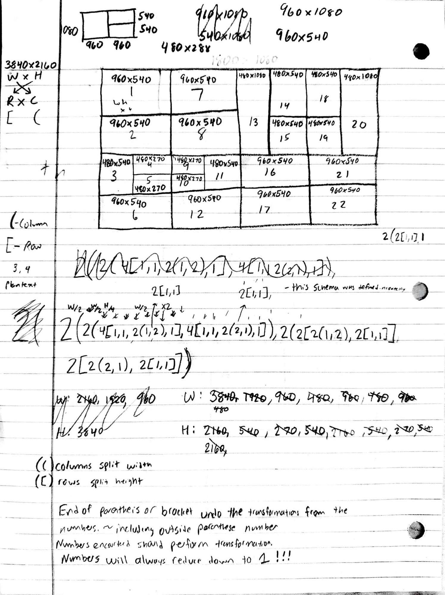
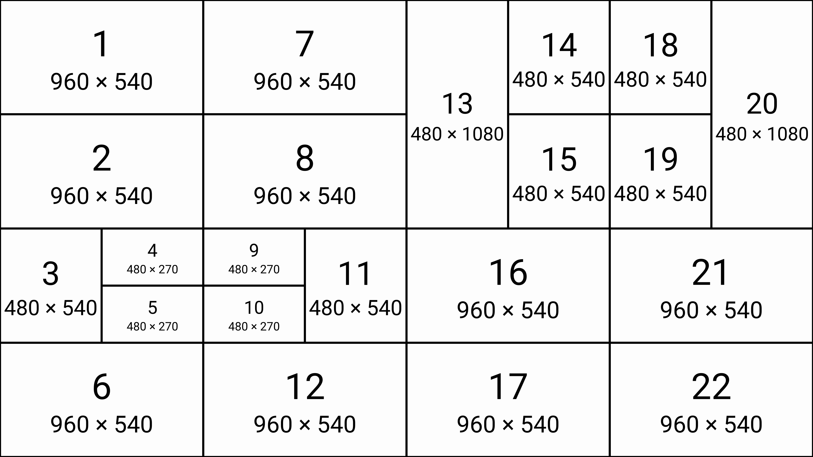

# 01 — 22-frame nested subdivision

The first worked example used to discover the m0 grammar. The sheet works out a
3840×2160 canvas subdivided into 22 frames, derives the width/height of each by
hand, and — in the margins — writes down the rules of the language itself.

| | |
|---|---|
| Canvas | 3840 × 2160 |
| Frames | 22 |
| Passthroughs / Nulls | 0 / 0 |
| Precision | 2 × 4 |
| Feasability | 8 x 8 px |
| Chars | 94 |

**Canonical string**:

```
2(2(4[1,1,2(1,2[1,1]),1],4[1,1,2(2[1,1],1),1]),2(2[2(1,2[1,1]),2[1,1]],2[2(2[1,1],1),2[1,1]]))
```

## The original derivation



and now Rendered through the current program (frames numbered 1–22):



perfect match

## The grammar, as first written down

Transcribed verbatim from the sheet's margins — this is the original definition
of m0:

- **`( )` — columns, split width.** A parenthesis group divides its region along
  the horizontal axis.
- **`[ ]` — rows, split height.** A bracket group divides its region along the
  vertical axis.
- **"Numbers encountered should perform [the] transformation."** A number is the
  split factor: it carves the current region into that many equal parts on the
  group's axis.
- **"End of a parenthesis or bracket undoes the transformations from the numbers
  (including the outside parenthesis number)."** Closing a group pops back to the
  parent region — the subdivision is scoped to the group.
- **"Numbers will always reduce down to 1 !!!"** The core invariant: every path
  of splits bottoms out at a leaf (`1` = a frame). This is what guarantees the
  derivation is finite and every region is explicitly addressed.

Axis legend at the top of the sheet: `W × H → R × C`, with `[` = row and
`(` = column.

## The derivation chains

The sheet works the geometry out longhand — every rectangle's size is *derived*
from the canvas, never given:

- **W:** 3840 → 1920 → 960 → 480 → 960 → 480 → 960 → 480
- **H:** 2160 → 540 → 270 → 540 → 2160 → 540 → 270 → 540 → 2160

## Notes on the discovery

The sheet is mid-discovery, not a clean spec — that's the point of keeping it.
A first pass of the string is marked **"this schema was defined incorrectly"**
and corrected below it; you can see the notation tighten (e.g. an early
shorthand `2(1,2)` becoming the explicit `2(F,2[F,F])`). The leaf token was `1`
before it gained the `F` alias, and passthrough was `0` before `>`.
