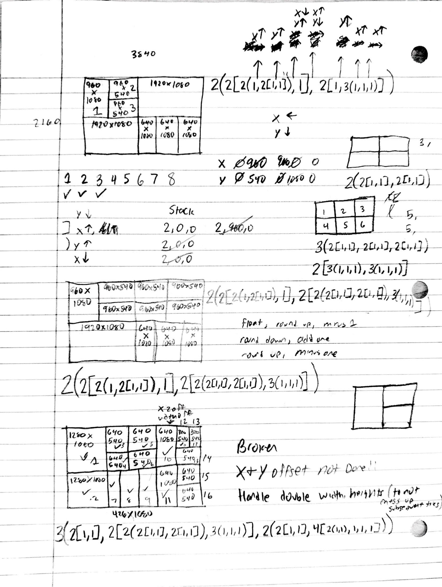
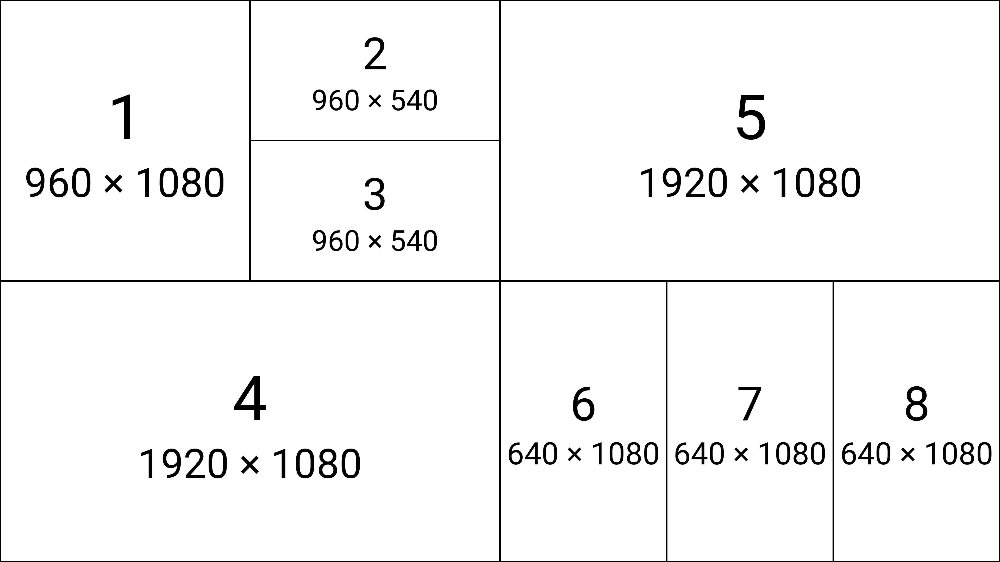
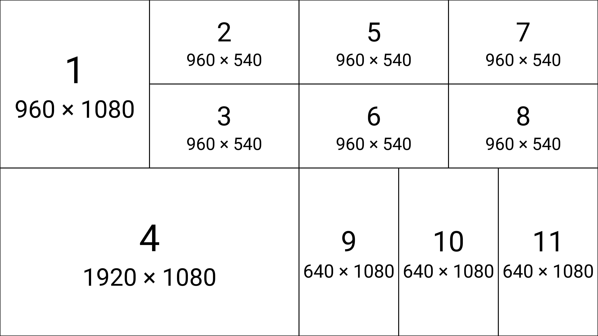
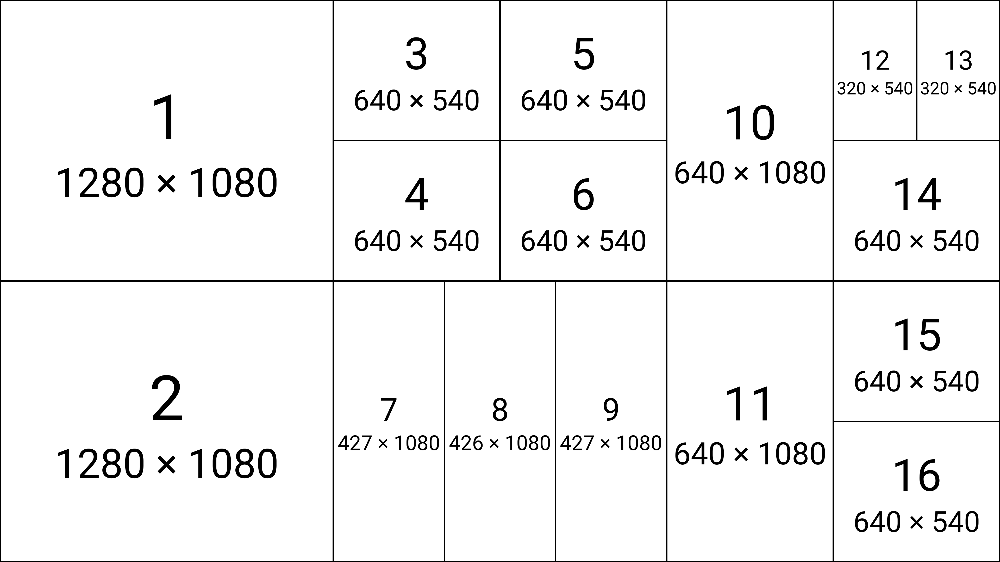

# 02 — Offset-stack + quantization

A single sheet working out **three** layouts at 3840×2160, used to derive two
mechanisms the engine still relies on:

1. The **offset stack** — how each split carries its weight *and* its x/y pixel
   offset down the tree, so a leaf knows where it sits on the canvas.
2. The **quantization rounding rules** — how a split distributes the fractional
   remainder when a region doesn't divide evenly.

It also documents a bug in the margins (**"X+Y offset not done"**, double
width/height tiles) — which **renders correctly today**, so this sheet is a
before-picture of a fix.

## The original derivation



## The three layouts

Each `.m0` is a genuine serialized file (canonical `1`/`0` payload — the notation
the sheet was written in) and opens in the app like any other layout.

| File | Canvas | Frames | Canonical string |
|------|--------|--------|------------------|
| [`layout-1.m0`](./layout-1.m0) | 3840×2160 | 8 | `2(2[2(1,2[1,1]),1],2[1,3(1,1,1)])` |
| [`layout-2.m0`](./layout-2.m0) | 3840×2160 | 11 | `2(2[2(1,2[1,1]),1],2[2(2[1,1],2[1,1]),3(1,1,1)])` |
| [`layout-3.m0`](./layout-3.m0) | 3840×2160 | 16 | `3(2[1,1],2[2(2[1,1],2[1,1]),3(1,1,1)],2(2[1,1],4[2(1,1),1,1,1]))` |

### Layout 1 — 8 frames

960×1080 + a 960×540 stack, a 1920×1080, then a 1920×1080 over three 640×1080.



### Layout 2 — 11 frames

Layout 1 with the top-right quadrant expanded to a 2×3 block of 960×540.



### Layout 3 — 16 frames (the "broken" one)

The sheet marks this **"Broken — X+Y offset not done!!"** and notes *"handle
double width/heights so you don't mess up subsequent tiles."* It renders
correctly in the current engine. Note tiles 7/8/9: a 1280-wide region split three
ways produces **427 / 426 / 427** — the quantization remainder spread the
rounding rules below are about.



## The insights, transcribed

**Axis convention** — `x ←`, `y ↓`. Offsets accumulate left-to-right (x) and
top-to-bottom (y); `[` splits height (rows), `(` splits width (columns).

**The offset stack** — each entry is `weight, xOffset, yOffset`, pushed as you
descend a split and popped at the closing bracket:

```
] x↑   2,0,0      2,960,0
) y↑   2,0,0
  x↓   2,0,0
```

with the worked offset rows:

```
x:  0   960  960   0    0
y:  0   540   0   1080   0
```

**The quantization rounding rules** — how the fractional remainder of an
uneven split is distributed (so adjacent tiles still share an exact integer
boundary, no seams):

- `float, round up, minus 1`
- `round down, add one`
- `round up, minus one`

**The bug it captures** — *"X+Y offset not done!! Handle double width/heights
(to not mess up subsequent tiles)."* A double-width/height tile shifts the offset
for everything after it; the sheet shows this was unhandled at the time. The
current engine handles it (layout 3 renders correctly), so this entry brackets a
fixed defect.

**Equivalence references** (margin sketches) — the same grid written two ways:

- `2(2[1,1],2[1,1])` — a 2×2.
- `3(2[1,1],2[1,1],2[1,1])` and `2[3(1,1,1),3(1,1,1)]` — two encodings of a 3×2.

These are the "columns-of-rows vs rows-of-columns" duality: the same rectangles,
a different traversal order (and a different leaf-numbering).
