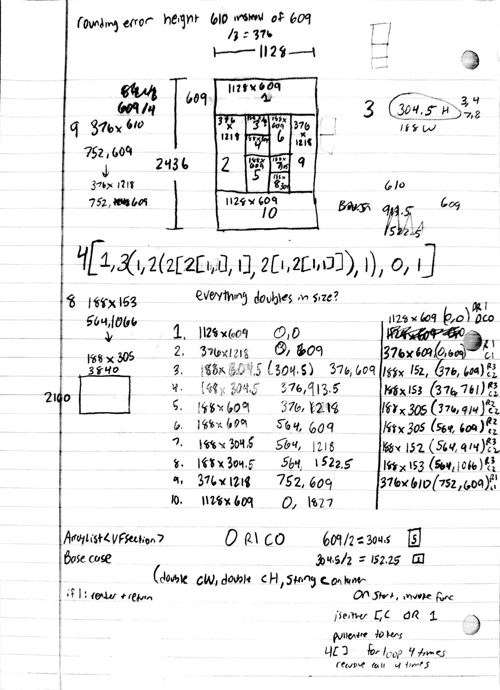
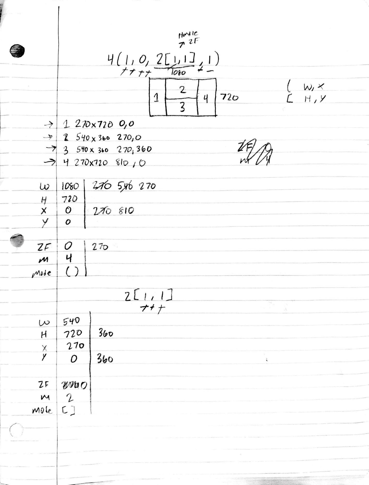
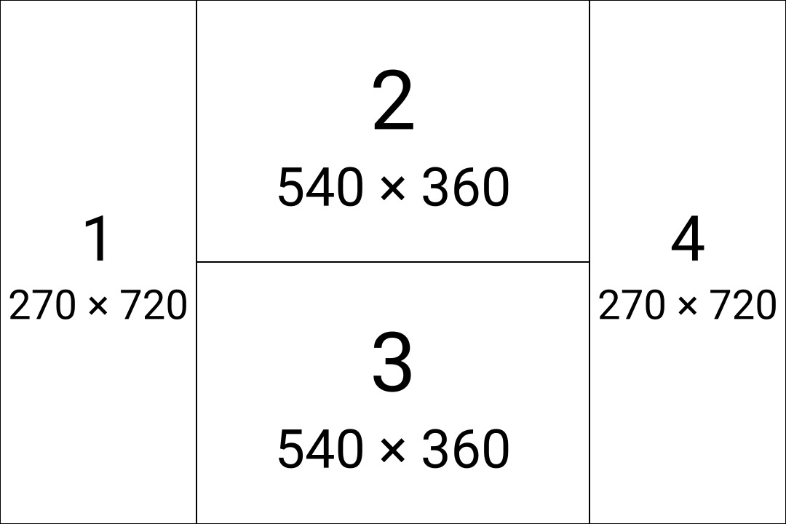
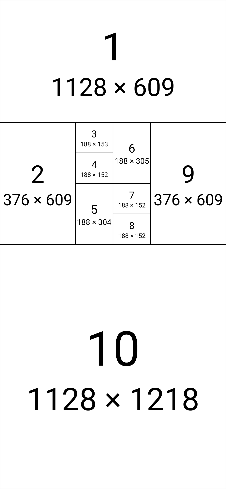
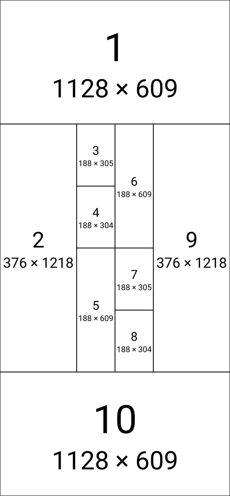

# 03 — Passthrough donation direction (legacy → current)

This sheet captures a **reversed language decision**: which way a passthrough
(`0` / `>`) donates its space.

- **Legacy:** a passthrough donated **backward** — its space went to the
  *previous* tile. That's the behavior worked out on this sheet.
- **Current:** a passthrough donates **forward** — its space goes to the *next*
  tile. Changed because forward donation is more elegant and avoids backtracking
  during the recursive parse.

It's a useful page in `history/` because it isn't just an old layout —
it's a **before/after of a design pivot**, and the same passthrough renders the
big region in two different places depending on the era.

## The original derivation (backward)

First, how it started. This sheet works out the recursive parse algorithm — the
`4[]` = loop / recurse 4×, base case `1` = render + return, the
`ArrayList<VFSection>` offset stack with row/column indices, doubling CW/CH — all
under the **legacy backward** rule, where a passthrough fed its space to the
*previous* tile.



## The decision (flip to forward)

Then the flip. This is the page where the call was made: **forward donation.**
Canvas 1080×720, a 4-way column split — [`decision.m0`](./decision.m0):

```
4(1, 0, 2[1,1], 1)
```

The `0` (the "zero-frame" / ZF on the sheet) is column 2. Forward donation hands
its 270px to the **next** child — the `2[1,1]` block — which widens to 540 and
splits into two 540×360 rows. Tiles 1 and 4 stay 270×720.

| tile | size | x,y |
|---|---|---|
| 1 | 270×720 | 0,0 |
| 2 | 540×360 | 270,0 |
| 3 | 540×360 | 270,360 |
| 4 | 270×720 | 810,0 |





The sheet also pins down the bookkeeping the decision turns on: parens carry
`(W, X)` and brackets carry `[H, Y]` (column splits divide width + advance x; row
splits divide height + advance y), each split tracks its factor `n` and `Mode`
(`()` vs `[]`), and the **ZF** (zero-frame) column is the donated span that gets
folded **forward** into the next child's dimension.

## The pivot, in one string

Canvas 1128×2436 — four top-level rows of 609px. The `0` is row 3. The only thing
that changes between the two eras is **where that 609px row goes**.

| | string | full-width regions `[y, h]` | big region |
|---|---|---|---|
| **Current** (forward) | `4[1,3(1,2(2[2[1,1],1],2[1,2[1,1]]),1),0,1]` | top `[0, 609]`, bottom `[1218, 1218]` | **bottom** (tile 10 = 1128×1218) |
| **Legacy** (backward) | `4[1,3(1,2(2[2[1,1],1],2[1,2[1,1]]),1),0,1]` | top `[0, 609]`, middle band `1218`, bottom `[1827, 609]` | **middle** (the `3(…)` band) |

Under forward donation the `0` feeds the **next** tile (the final `1` → the
bottom region doubles). Under the legacy backward rule the same `0` fed the
**previous** region (the middle `3(…)` band doubled instead). The large region
flips from the middle to the bottom.

### Current (forward) — `current.m0`

The original string from the sheet, rendered under today's engine.



### Legacy (backward) — `legacy.m0`

Today's engine only donates forward, so the legacy layout is reproduced by moving
the `0` **one slot earlier** — `4[1,0,3(…),1]`. Now row 2's `0` donates forward
into the band, so the band doubles (1128×1218 in the middle) and the bottom tile
stays 1128×609 — matching the sheet. This `…,0,3(…)…` ↔ `…,3(…),0,…` shift is the
mechanical translation between the two eras.


