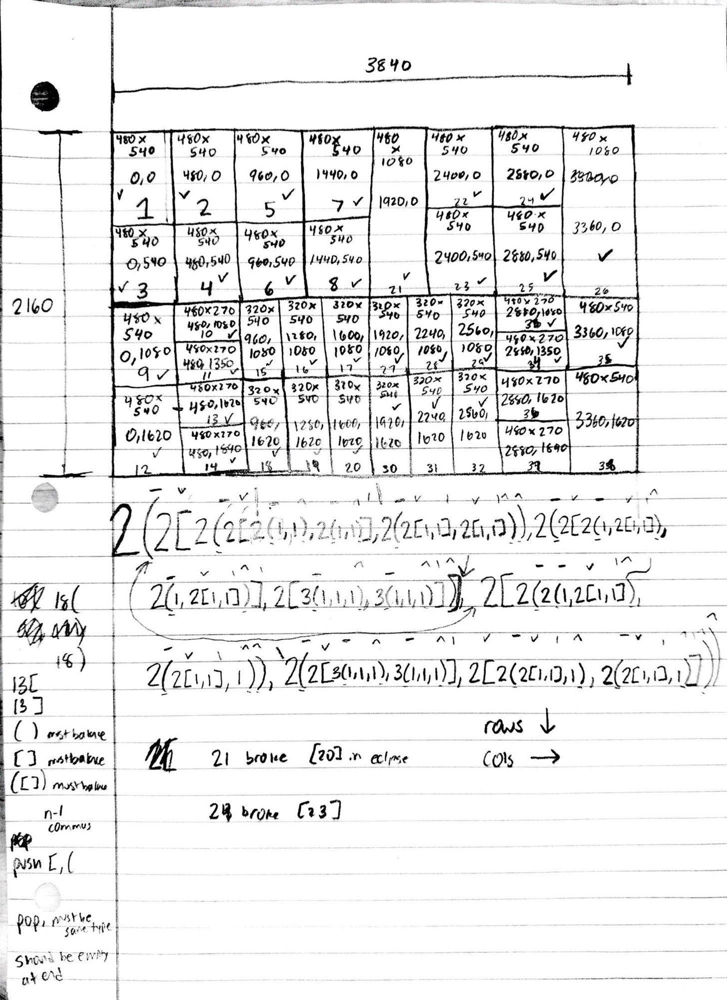
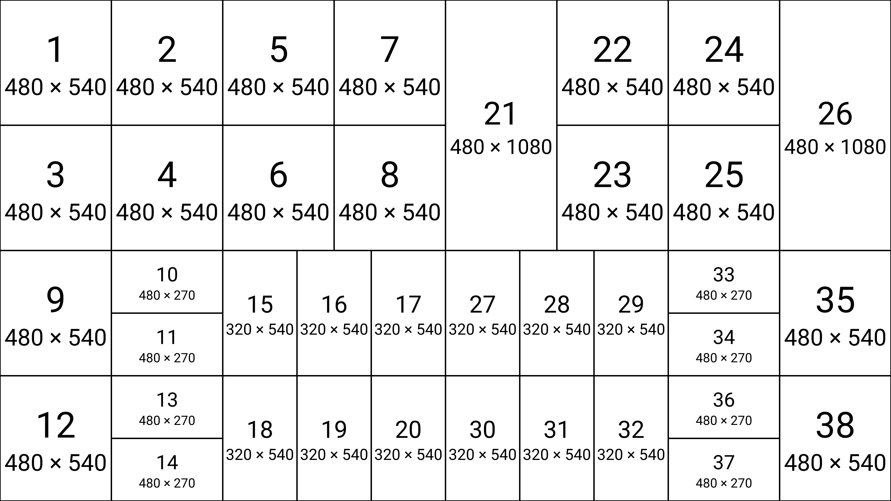

# 04 — First heavy stress-test (38 frames)

The first deliberately **heavy** layout — 38 frames worked out by hand at
3840×2160 to stress-test the recursive parse. Nothing next to the
hundreds-of-thousands-of-character (up to ~1M) layouts that are routine now, but
for an on-paper hand derivation it was a hero effort: a big, balanced tree pushed
far enough to shake out the grammar's bookkeeping rules (which are transcribed at
the bottom of the sheet).

> **Reconstructed, not transcribed.** The original handwritten string spans three
> lines and a stray character had crept in. So this entry's `.m0` was rebuilt
> from the sheet's **grid geometry** instead — every tile's `w×h @ x,y` was read
> off the drawing, then a single m0 string was derived that renders to exactly
> those 38 rectangles (verified: 38/38 rects, none missing, none extra). The
> result matches the intended layout.

## The original derivation



## The layout

A genuine serialized [`layout.m0`](./layout.m0) (canonical `1`/`0` payload — the
notation the sheet was written in), 3840×2160, **38 frames**:

```
2(2[2(2[2(1,1),2(1,1)],2(2[1,1],2[1,1])),2(2[2(1,2[1,1]),2(1,2[1,1])],2[3(1,1,1),3(1,1,1)])],2[4(1,2[1,1],2[1,1],1),2(2[3(1,1,1),3(1,1,1)],2[2(2[1,1],1),2(2[1,1],1)])])
```



### Reading it from the big numbers down

The way it was built: start at the top-level split, then keep subdividing the
biggest regions.

- **Top level** — `2( LEFT, RIGHT )`: one column split, 1920 each half.
- **LEFT** = `2[ TOP, BOTTOM ]` (two 1080 rows):
  - `TOP` = `2(2[2(1,1),2(1,1)],2(2[1,1],2[1,1]))` → tiles **1–8**, two 2×2 quads.
  - `BOTTOM` = `2(2[2(1,2[1,1]),2(1,2[1,1])],2[3(1,1,1),3(1,1,1)])` → tiles **9–14**
    (a full-height frame beside a 270-px stack, twice) and **15–20** (a 3×2 of
    320-wide cells).
- **RIGHT** = `2[ TOP, BOTTOM ]`:
  - `TOP` = `4(1,2[1,1],2[1,1],1)` → tiles **21–26**. The two outer columns
    (**21**, **26**) are single full-height `480×1080` frames; the two inner
    columns each split into a `2[1,1]` pair. This is the sheet's *"21 broke [20]"*
    / *"24 broke [23]"* note — a full-height tile that breaks out of the row split
    its neighbors sit in.
  - `BOTTOM` = `2(2[3(1,1,1),3(1,1,1)],2[2(2[1,1],1),2(2[1,1],1)])` → tiles
    **27–32** (another 3×2 of 320-wide cells) and **33–38** (270-px stacks beside
    full-540 frames).

> **No passthrough.** Every split here divides into equal parts — the full-height
> tiles (21, 26) are plain single frames sitting in a wider split, not donated
> space. So there's no `0` / `>` anywhere in the string. (If a `0` shows up in a
> transcription of this layout, that's the giveaway something slipped.)

## The grammar invariants, transcribed

The bottom-left of the sheet writes down the parse/validation rules this layout
exercised — the same invariants the string validator enforces today:

- **`( )` must balance** — every column-split paren opens and closes.
- **`[ ]` must balance** — every row-split bracket opens and closes.
- **`([ ])` must balance** — the two kinds must nest cleanly (no crossing).
- **`n-1 commas`** — a split of factor `n` has `n-1` commas, i.e. exactly `n`
  children.
- **`push [` / `(`** — opening a split pushes its bracket onto a stack.
- **`pop, must be same type`** — a closing bracket pops, and must match the
  same type that was pushed.
- **`should be empty at end`** — when the string ends the stack must be empty
  (everything opened was closed).

**Axis convention** (right margin): `rows ↓`, `cols →` — `[` splits height (rows
stack downward), `(` splits width (columns run rightward).

These are the "one token out of place and the whole thing is busted" rules — the
reason m0 lives in structured, aggressively validated files rather than loose
text, and the reason this entry had to be rebuilt from geometry rather than
retyped from the page.
