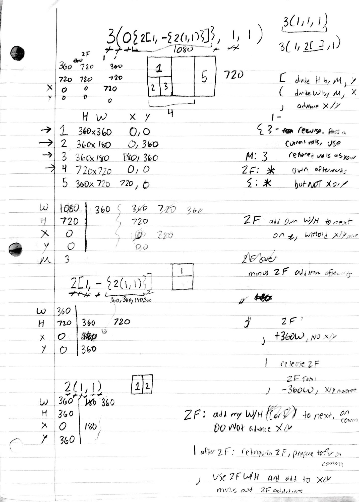
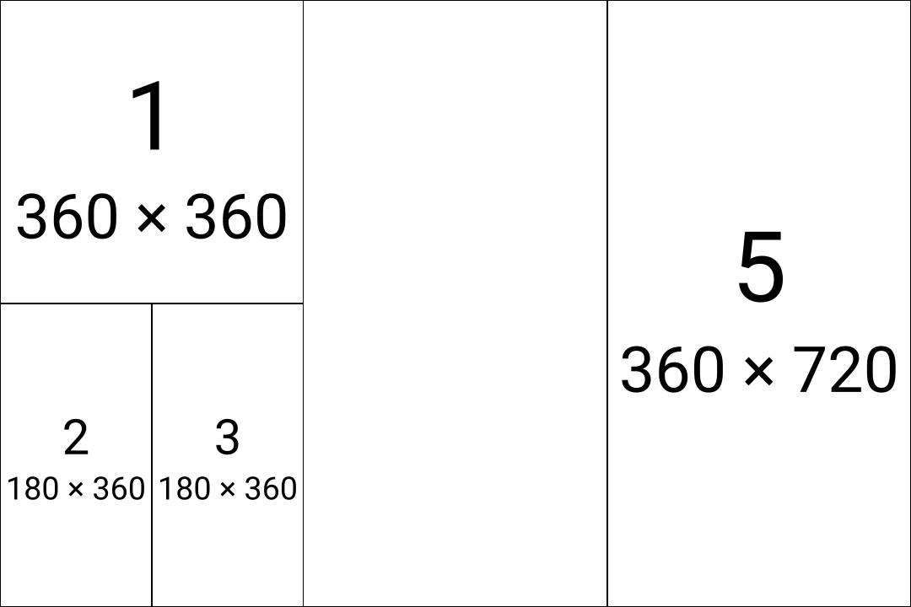

# 05 — Overlays × passthrough + the zero-frame walk algorithm

The page where the language **starts mixing concepts**. Up to here the sheets
subdivide a canvas into a clean partition; this one stacks an **overlay onto a
passthrough** (`0{…}`) and even an **overlay onto a null** (`-{…}`) — sublayouts
that borrow another node's geometry but paint on their own z-layer. Alongside the
drawing, the **walk-the-string algorithm gets formalized** for the first time:
the margin notes work out exactly what the math has to do to each token as the
cursor walks the string.

> **The algorithm here is early v1.** The zero-frame (ZF) bookkeeping transcribed
> below is the *original* design. It worked for a fair number of strings but not
> all of them — today's engine donates/defers passthrough space differently. This
> entry is kept as a **design artifact**: it shows how the mechanism was first
> reasoned about, not how it works now. The remarkable part is that the
> **language and this exact layout are stable across that whole rewrite** — the
> string below still renders to the sheet's five-tile diagram today (verified),
> even though the algorithm underneath was replaced.

## The original derivation



## The layout

A genuine serialized [`layout.m0`](./layout.m0), canvas **1080×720**:

```
3(0{2[1,-{2(1,1)}]},1,1)
```

A 3-way column split (M=3 → 360 each). The first child is a **passthrough with an
overlay** (`0{…}`); the other two are plain frames. The passthrough donates its
360px forward, so the next `1` grows to 720 wide — and the overlay paints over
that same 720-wide region.

Rendered under today's engine, it reproduces the sheet's diagram exactly:

| sheet tile | renders as | role |
|---|---|---|
| **1** | `360×360 @ 0,0` | overlay row 1 — the `1` in `2[1,…]` |
| **2** | `180×360 @ 0,360` | the `-{2(1,1)}` null's overlay (left half) |
| **3** | `180×360 @ 180,360` | the same null's overlay (right half) |
| **4** | `720×720 @ 0,0` | the **base** `1` the passthrough donated into — painted *under* the overlay |
| **5** | `360×720 @ 720,0` | the trailing `1` |



In the wireframe, tiles **1 / 2 / 3** occupy the left half of tile **4**'s
720×720 box — that overlap *is* the overlay-on-passthrough behaviour: the overlay
hooks into the passthrough's geometry but renders on a layer above the tile the
space was donated to. (The wireframe suppresses tile 4's own label there, since a
higher-z tile covers it — so the overlay reads as sitting on top rather than the
base's "4 / 720×720" bleeding through.)

## The overlay × passthrough mechanic (still true today)

- **`0{…}` — overlay on a passthrough.** The `0` donates its space forward as
  usual; the `{…}` is a recursive sublayout anchored to that geometry, painted on
  top of whatever claims the donated space.
- **`-{…}` — overlay on a null.** Same idea on a `-` (empty) slot: the cell holds
  no base tile, but the overlay still draws into its bounds. Here `-{2(1,1)}`
  splits its 360×360 cell into the two `180×360` halves (tiles 2, 3).
- **Overlays nest.** `0{ 2[1, -{2(1,1)}] }` is an overlay (on the passthrough)
  that itself contains an overlay (on the null) — z-layers stacking on
  space-modifiers two levels deep.

## The walk-the-string algorithm, transcribed (early v1)

The margin formalizes the cursor's job per token. Kept verbatim as the original
design — **superseded**, see the caveat above.

**Per-token actions:**

- `[` — divide **H** by **M**, advance **Y** (row split).
- `(` — divide **W** by **M**, advance **X** (column split).
- `)` — advance X/Y (close the split).
- `1` — a frame (render + return).
- `-` — a null (no render).
- `{…}` — **recurse**: pass in the current values, use the returned values as
  your own afterwards — **but not X or Y**.
- `M` — the split factor for the current level (here `M: 3`).

**The zero-frame (ZF) contract** — the heart of the early passthrough handling:

- `ZF: add my W/H (the split axis's) to the **next** child, **on the comma**. Do
  **not** advance X/Y.`
- `1 after ZF: relinquish the ZF, prepare to fix up on the comma.`
- `) after ZF: use the ZF W/H and add to X/Y, then **minus out** the ZF
  additions.`
- `ZF over: minus the ZF addition afterwards.`

i.e. a passthrough *withholds* its X/Y advance, *adds* its width/height onto the
next sibling at the comma, and the accumulated ZF offset is *unwound* once the
recipient closes — the v1 way of making "donate forward" come out to the right
numbers.

## Solving by hand — divide and conquer

The sheet also shows the **method**, not just the result: the full string is
peeled into subsets that are each solved on their own, then composed.

1. `3(0{2[1,-{2(1,1)}]},1,1)` — the whole thing (W=1080, H=720, M=3).
2. `2[1,-{2(1,1)}]` — the overlay subtree (W=360, H=720): a `1` over a
   `-{2(1,1)}`.
3. `2(1,1)` — the innermost overlay (W=360, H=360): the two `180×360` halves.

Each is worked with its own little **W / H / X / Y / M** table. This *is* the
recursion — "pass in current vals, use returned vals as your own" — done by hand
before it was code.
