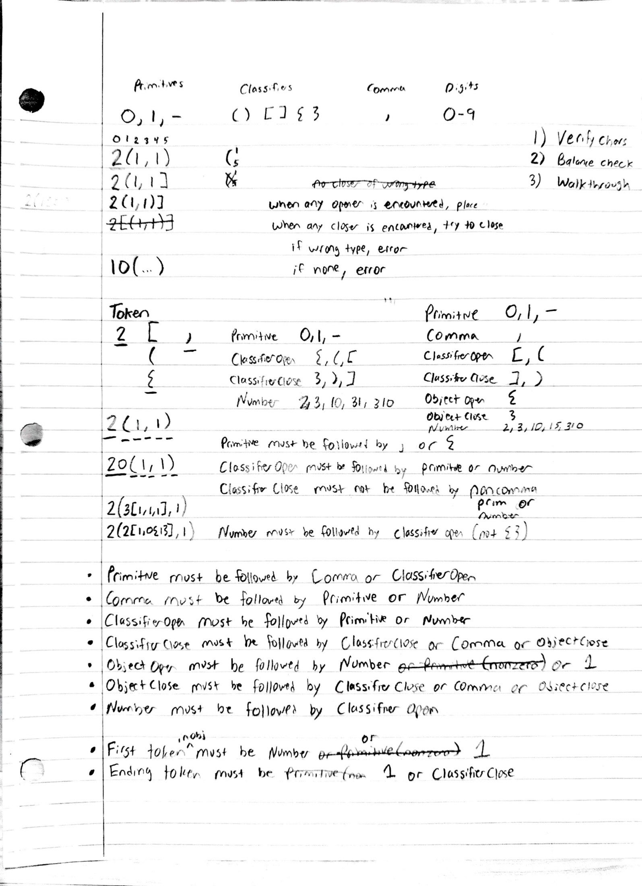

# 06 — The validation rules (the end of the notebook)

The capstone page. Once the grammar and a body of worked examples existed, the
rules of **DSL validation** got written down here — the token taxonomy, the
adjacency grammar, and the three-step validation pipeline. With this page in
hand, the hand-derivation was done: the first *real* parser was written next (in
Java, in Eclipse), with the worked examples from these sheets encoded directly as
tests. That parser was sharpened over and over — across increasingly heavy
real-world layouts — into the optimized validator that ships today.

So this entry is unusual: it has **no `.m0`** (it's grammar, not geometry). Its
value is that almost everything on it is still encoded in
[`packages/dsl/src/validate/m0StringValidator.ts`](../../src/validate/m0StringValidator.ts) —
and the one rule that *isn't* is documented below.



## The three-step pipeline — still the code's structure, verbatim

| Sheet | Validator function | Error raised |
|---|---|---|
| 1) Verify chars | `characterCheck` | `INVALID_CHAR` |
| 2) Balance check | `balanceCheck` | `UNBALANCED` |
| 3) Walkthrough | `iterativeCheck` + `tokenCheckIndexed` | `TOKEN_RULE` / `TOKEN_COUNT` |

## The token taxonomy — 1:1 with the `ValidationType` union

The page refines its first guess (everything bracket-shaped is a "Classifier")
into a seven-way taxonomy, splitting `{ }` out as **Object Open/Close** — the
overlay operators. That exact split is the validator's `ValidationType`:

```
PRIMITIVE  ·  COMMA  ·  CLASSIFIEROPEN  ·  CLASSIFIERCLOSE
OBJECTOPEN ·  OBJECTCLOSE  ·  NUMBER
```

- **Primitive** — `0` `1` `-`
- **Comma** — `,`
- **Classifier Open / Close** — `(` `[` / `)` `]` (splits)
- **Object Open / Close** — `{` / `}` (overlays)
- **Number** — `2`, `3`, `10`, `310`, … (a split count: `1` followed by a digit,
  or any `2`–`9` run)

## The adjacency rules vs `checkValidationRules`

| Rule on the page | Validator today | Status |
|---|---|---|
| Primitive → Comma or **ClassifierOpen** | Primitive → Comma, Classifier**Close**, ObjectClose, ObjectOpen | ❌ **no longer true** |
| Comma → Primitive or Number | same | ✅ exact |
| ClassifierOpen → Primitive or Number | same | ✅ exact |
| ClassifierClose → ClassifierClose, Comma, ObjectClose | + **ObjectOpen** | ➕ evolved |
| ObjectOpen → Number or `1` | + `-` / `0` primitives | ➕ evolved |
| ObjectClose → ClassifierClose, Comma, ObjectClose | same | ✅ exact |
| Number → ClassifierOpen | same | ✅ exact |
| First token → Number or `1` (nonzero) | same | ✅ exact |
| Ending token → `1` / ClassifierClose | + `-` null, + ObjectClose `}` | ➕ evolved |

### The one rule that's no longer true

Bullet 1 reads **"Primitive must be followed by Comma or ClassifierOpen."** The
validator does the *opposite*: a primitive ends a cell, so it's followed by a
Classifier**Close** (or a comma, an object close, or an object-open overlay). A
primitive followed by a Classifier**Open** — `1(`, `1[` — is *explicitly
illegal* (`ILLEGAL_ONE_SPLIT`: "Use a count ≥ 2 for splits"). Almost certainly an
Open↔Close slip on the page that got fixed the moment it became real code.

### The two that evolved

Both ➕ rows are the **overlay system maturing** after this page:

- **ClassifierClose → ObjectOpen** — a *group* can now carry an overlay
  (`2(1,1){…}`), not just a primitive.
- **ObjectOpen → any primitive** — an overlay body can now be a non-painting
  **null-anchor** (`{-}`), so `{` may be followed by `-` or `0`, not only a
  number or `1`. (Bodies that contribute no node — `{}` and `{0}` — are rejected
  semantically with a targeted message.)

These are exactly the "sharpened it over and over" refinements: the grammar held;
the overlay semantics grew.

## What the page didn't have yet — the semantic layer

The shipping validator adds **antipattern/semantic checks** that aren't on this
syntax-era page (added later, across heavy real-world layouts):

- `NO_SOURCES` — a layout must contain at least one `1` / `F`.
- `PASSTHROUGH_TO_NOTHING` — a trailing `0` has no next tile to donate to.
- `OVERLAY_CHAIN` (`}{`) and double-open (`{{`) rejects.
- empty-overlay guards (`{}`, `{0}`).

## The page's examples, run through today's validator

The valid/invalid examples sketched on the sheet, fed to `validateM0String`:

| String | Result |
|---|---|
| `2(1,1)` | ✅ valid |
| `2(1,1]` | ❌ `UNBALANCED` (close of wrong type) |
| `2(1,1)]` | ❌ `UNBALANCED` (extra close) |
| `10(1,1,…)` | ✅ valid (multi-digit count) |
| `1(1,1)` | ❌ `ILLEGAL_ONE_SPLIT` (`1(` — the page's bullet-1 case) |
| `2(1,0)` | ❌ `PASSTHROUGH_TO_NOTHING` |
| `2(1,1){-}` | ✅ valid (group overlay, null-anchor body) |
| `3(0{2[1,-{2(1,1)}]},1,1)` | ✅ valid (entry 05's overlay-on-passthrough) |
| `-{2(1,1)}` | ❌ `TOKEN_RULE` — a null-with-overlay is valid *as a child*, but not as the root (first token must be `1`/Number) |
| `2[1,1]{}` | ❌ `INVALID_EMPTY` (empty overlay body) |

The `1(1,1)` row is the live proof of the one-no-longer-true rule: the page would
have *allowed* a primitive before a classifier-open; the validator rejects it.
