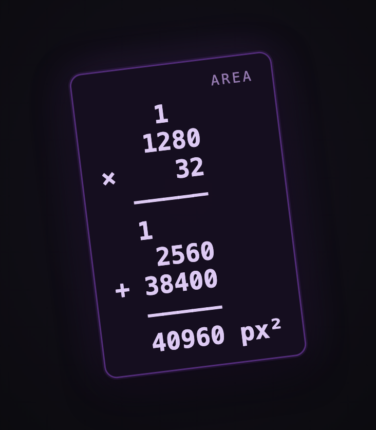
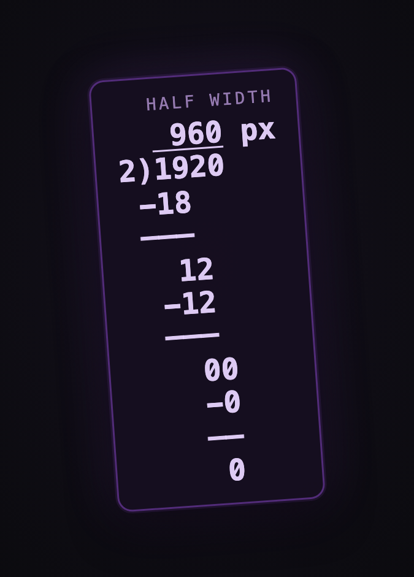

# m0 history — original hand-drawn derivations

> 🧑 **Made by a human, not AI.** The m0 language — its grammar, its operators,
> its shape — was designed and drawn by hand by a person solving real layouts on
> paper. No AI invented it. These sheets are the proof: you can watch the
> language being figured out, mistakes and all.

The genesis artifacts of the m0 language.

m0's grammar was not designed from graph theory or an existing data structure.
It **fell out of solving real layouts by hand** — drawing a target subdivision,
working out the width/height math that produces those rectangles, and writing
down the shortest representation that could reproduce them. The shape of the
language is whatever those constraints forced it to be.

This folder preserves those source documents: each entry pairs the **original
hand-drawn derivation** with the **real `.m0` file** it produced, so the
provenance of the language is legible — you can watch the grammar being
discovered, notation and all.

## Layout

One folder per derivation:

```
NN-slug/
  derivation.png   the original hand-drawn sheet
  layout.m0        the real, openable .m0 file it produced (serialized)
  rendered.png     the same layout rendered in the current app (optional)
  README.md        transcription of the sheet + notes specific to this entry
```

`layout.m0` is a genuine serialized `.m0` (header + canonical payload), produced
via `@m0saic/dsl-file-formats` `serializeM0File` — it opens in the app like any
other layout. Note the canonical payload uses the **original `1` / `0`
notation** (`F`→`1`, `>`→`0`), which is exactly the notation these sheets were
first written in.

## The Founder's Historic Set

[`founders-historic-set.m0p`](./founders-historic-set.m0p) sits next to this
README: a single `.m0p` pack collecting **every layout in this folder** as
variants (9 in all — entries 01–05; entry 06 is grammar, not a layout, so it
carries no `.m0`). Each is a genuine, still-valid layout; each variant's
`meta.source` points back to its history entry + hand-drawn sheet. Open the pack
in the app to flip through the whole lineage in one place — a cheeky callback to
where the grammar came from.

## Entries

| Entry | Canvas | Frames | Notes |
|-------|--------|--------|-------|
| [`01-22-frame-grid`](./01-22-frame-grid) | 3840×2160 | 22 | The first worked example — also where the grammar's core rules were written down. |
| [`02-offset-stack-quantization`](./02-offset-stack-quantization) | 3840×2160 | 8 / 11 / 16 | Three layouts on one sheet — derives the offset-stack (weight + x/y offset) and the quantization rounding rules; brackets a since-fixed double-width/height offset bug. |
| [`03-passthrough-donation-direction`](./03-passthrough-donation-direction) | 1080×720 · 1128×2436 | 4 / 10 | A reversed language decision — passthrough (`0`/`>`) once donated space **backward**, now **forward**. Includes the actual **decision page** (`4(1,0,2[1,1],1)` — `0` widens the next block) plus a legacy-vs-current before/after. |
| [`04-first-heavy-stress-test`](./04-first-heavy-stress-test) | 3840×2160 | 38 | The first deliberately **heavy** layout — 38 frames hand-derived to stress-test the recursive parse. Reconstructed from the sheet's grid geometry (38/38 rects verified). Its legend writes down the grammar invariants: balance, `n-1` commas, push/pop-same-type, empty-at-end. |
| [`05-overlays-and-the-zero-frame-algorithm`](./05-overlays-and-the-zero-frame-algorithm) | 1080×720 | 5 | Where concepts **mix** — an overlay on a passthrough (`0{…}`) and on a null (`-{…}`), plus the first formalized walk-the-string algorithm (the early-v1 zero-frame bookkeeping, since superseded). The grammar held across the rewrite: the string still renders to the sheet's diagram today. |
| [`06-validation-rules`](./06-validation-rules) | — | — | **The end of the notebook.** The token taxonomy + adjacency grammar + 3-step validation pipeline, written down right before the first real (Java/Eclipse) parser. No `.m0` — it's grammar, not geometry. Cross-checked against today's validator: nearly all of it is still encoded; exactly one rule is no longer true (documented inline). |

> Entry `01` is special: its sheet contains the **original definition of the
> grammar** (the `( )`/`[ ]` axis rules and the "numbers always reduce to 1"
> invariant). Those rules are transcribed verbatim in its README.

---

## Why a string of integer math

One decision mattered from the very first sheet: a layout is a **string**. Plain
text is the most universal transport there is — the easiest thing to pass around,
store, diff, paste, log, or send over a wire. No schema, no binary format, no
container. Just characters.

And the algorithm under it is deliberately **primitive**: integer math and string
manipulation, nothing else. No floats to drift, no platform quirks, no
dependencies — just the two operations every language and every operating system
has supported since day one. That's what makes it a *global* solution: the same
DSL string produces the **same deterministic rectangles** whether the parser is
written in Java, TypeScript, C, Rust, or Python, on any OS, with zero
reimplementation drift. A blob of text in, exact rectangles out, everywhere.

That primitiveness is also why everything circles the DSL. Every layer of the
ecosystem reads and writes the same string and runs the same math — the language
isn't one feature among many, it's the substrate the whole system is built on,
including the parts that look orthogonal to it. Get a deterministic set of
rectangles from a single portable string, and what you build on top of them is
wide open. That ceiling is the point — and proving how high it goes is what the
m0saic ecosystem is here to do.

---

## Founder's note

m0saic started as an idea around **2021**, fresh out of college. Back then I was
a video editor — I made Call of Duty montages — and I knew how to lay things out
like this by hand. The problem was that it was *manual*. I had to redo it every
single time, and I couldn't shake the feeling that there had to be a way to
automate it. I looked, and I couldn't find anything that did quite *this*.

What I kept coming back to was: I needed a way to say a whole layout in **one
word** — one blob of information. Not a name like "apple" or "beta," because a
name tells you nothing about whether it's a two-split or a three-split. It had to
be **math-based**: a single piece of data that hands you exactly the layout you
want, and from there it's just filling in rectangles. That was the whole idea.
The sheets in this folder are me chasing it (alongside a notebook full of similar drawings) — days spent drawing examples and
working out the math, because it *felt* like there had to be a way.

It took months to get the first real parser and validator working (in Java, in
Eclipse). I'm still a little proud that the first parser/validator holds up to a surprising amount of DSL today —
it only started choking once you got into the hundreds of thousands of nodes/chars,
since it wasn't built for perf optimization yet. Then life happened, and this stayed a side
project for a while. When I came back to it, I learned FFmpeg and wired the
language to it to actually generate video. That first version was rough: it only
ran in Eclipse, it couldn't compile to executable (I literally never did (...could), it was debugger only), and every render was one enormous,
unforgiving JSON config. But I learned an enormous amount.

Eventually I realized that the language was powerful but it lacked *tooling* — it
was still too manual to be worth much over just hand-writing a filter graph. I
knew the idea could scale into something far stronger; I just had to build the
pieces around it. That's what this project is. The first commit of the
TypeScript/React rewrite — m0saic as it exists now — was **November 2025**. But
the bones go all the way back to that recent grad in 2021.

There's a personal thread running through all of it. I've loved engineering since
I was a kid, and this little geometry idea turned into one of the most genuinely
interesting problem spaces I've ever worked in. I want to take it as far as it can
go — in the open. If you're a developer reading this: I'd love your eyes, your
ideas, and your arguments. The whole point is to build an **ecosystem** around
this, not a walled garden.

> **The mantra:** one small geometry idea, a single math-based blob that becomes a
> layout — taken as far as it can possibly go, in the open, with whoever wants to
> build. That's the vision. Everything in this folder is where it began.

---

## 🥚 Easter Egg 🥚
> _Ever notice the **render hero** in Mosaic flash DSL math now and then —
> width/height chains, offset stacks, a half-finished split being worked out?
> That's not decoration. It's a callback to these pages: a younger me derived
> the whole algorithm exactly like that, by hand, on lined paper. The hero is
> just doing out loud what's pinned up in this folder._

<p align="center">
  
  &nbsp;&nbsp;
  
</p>

<sub>Real cards from the render hero. Every digit is derived from the parser's
actual rect math — the area of a focused cell (`1280 × 32`), a side halved by long
division (`1920 ÷ 2`) — drawn the same longhand way as the sheets above.
Source: <a href="../../../apps/mosaic/web/src/components/renderHeroMath.ts"></a>.</sub>
