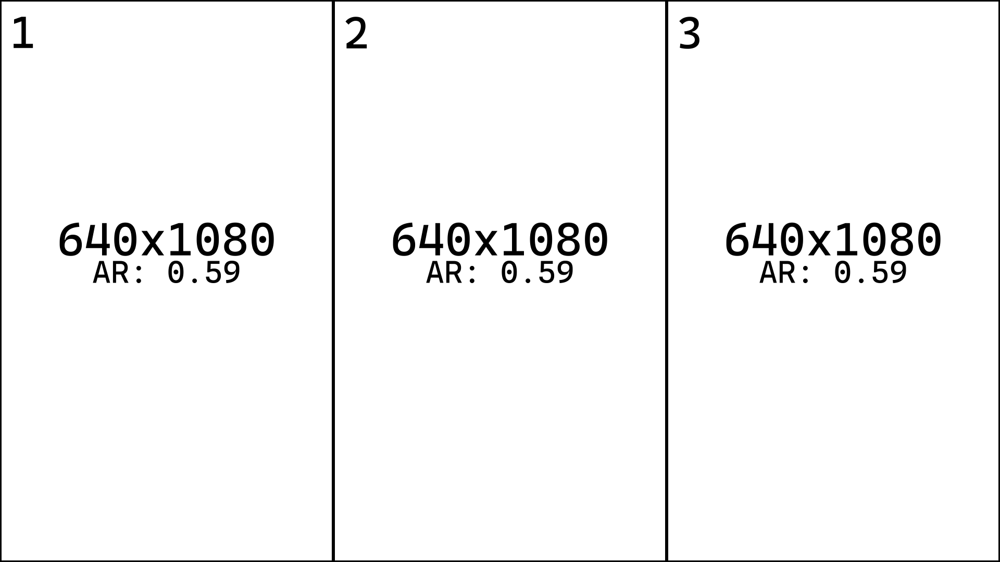
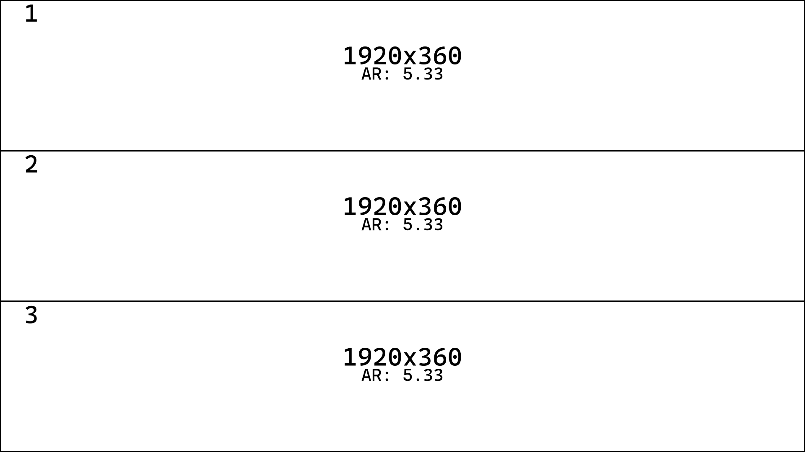
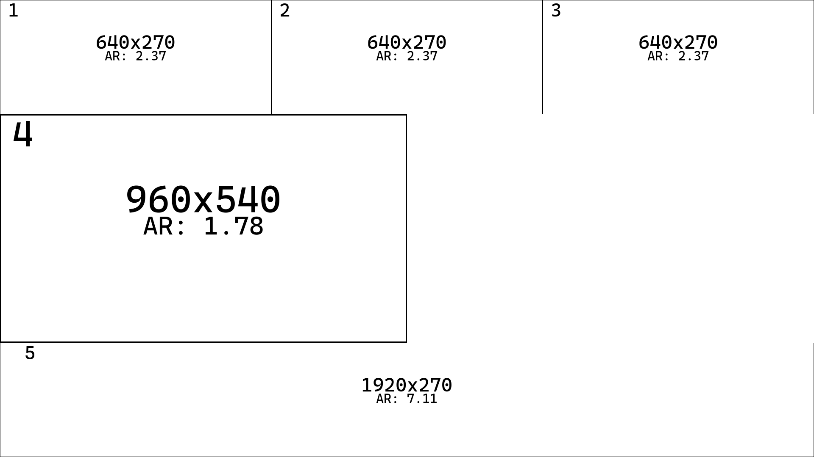
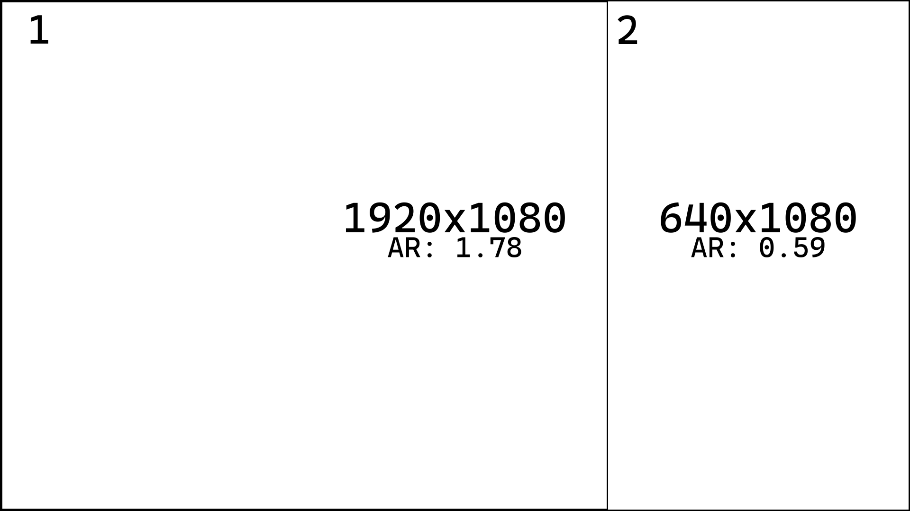
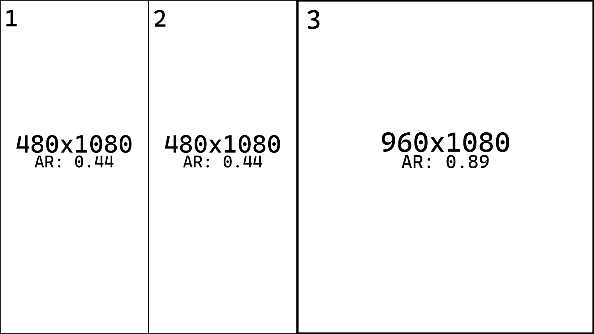

# m0saic DSL: A Deterministic Algebra for Rectangular Layouts

Quentin Simoneaux  
m0saic LLC  
New York, USA  
quentin@m0saic.io <br>
https://m0saic.io <br>
April 2026

---

## Abstract

Rectangular layouts are widely used in user interfaces, media composition, and visualization systems, yet most layouts are defined through graphical tools or runtime layout engines whose representations are difficult to serialize, version, and reproduce deterministically.

This paper introduces **m0saic DSL**, a compact domain-specific language for deterministic rectangular layout specification. Layouts are encoded as recursive spatial partitions of a canvas using a concise textual grammar that supports axis-aligned splits, passthrough space propagation, and compositional overlays.

Each valid expression resolves to a unique set of rectangles with well-defined spatial relationships. Because the DSL encodes geometry independently of rendering engines and runtime environments, identical layout strings produce identical rectangle sets across implementations without pixel drift.

The language provides a minimal algebra for spatial composition suitable for deterministic layout editors, automated media pipelines, and layout-driven rendering systems.

## 1. Introduction

Rectangular layouts are a fundamental structure in modern computing systems. User interfaces, media compositions, dashboards, and data visualizations all rely on spatial arrangements of rectangular regions. These layouts are typically designed visually using graphical tools or generated dynamically by layout engines.

Most existing layout systems fall into two categories. The first consists of graphical design tools such as Figma, Sketch, or Adobe products. These tools provide powerful visual editing capabilities, but the layouts they produce are stored in complex document formats that are difficult to diff, version, or reuse outside the original application.

The second category includes programmatic layout systems such as CSS Grid, Flexbox, and constraint-based user interface frameworks. These systems are designed for runtime layout resolution rather than deterministic geometry description. As a result, the final geometry of a layout may depend on the behavior of the rendering engine, implicit constraints, or environmental differences.

In many contexts, however, deterministic spatial layouts are desirable. Automated media generation pipelines, reproducible visualization systems, and layout-driven rendering engines benefit from layouts that can be expressed as compact, immutable descriptions with predictable geometric output.

This paper introduces **m0saic DSL**, a domain-specific language for encoding rectangular layouts as deterministic spatial partitions. The language represents layouts as recursive axis-aligned decompositions of a rectangular canvas. A layout expression defines how space is subdivided through splits, passthrough space propagation, and compositional overlay structures.

The m0saic DSL is also referred to as **m0** in abbreviated form. In this paper, the terms *m0saic DSL* and *m0* are used interchangeably to refer to the language and its canonical string representation.

Each valid layout expression resolves to a unique set of rectangles with well-defined spatial relationships. Because the DSL encodes geometry independently of rendering engines, programming languages, and runtime environments, identical layout strings produce identical rectangle sets across implementations and platforms.

The remainder of this paper describes the design and semantics of the language. Section 2 introduces the grammar and primitive constructs of the m0saic DSL. Section 3 describes the deterministic rectangle resolution algorithm. Section 4 defines the core invariants of the system. Section 5 specifies canonicalization and validation. Section 6 outlines implementation details, and Section 7 discusses applications.

## 2. The m0saic DSL

The m0saic DSL encodes rectangular layouts as recursive spatial partitions of a canvas. A layout is represented as a compact textual expression describing how a rectangular region is subdivided into smaller regions and how those regions resolve into frames or empty space.

The language operates on a small fixed token set shown below.

| Token | Meaning |
|------|--------|
| `(` `)` | Column split container |
| `[` `]` | Row split container |
| `{` `}` | Overlay container |
| `,` | Child separator |
| `1` | Canonical frame token representing a concrete rectangular frame |
| `0` | Passthrough operator that propagates space to the next concrete frame |
| `-` | Explicit absence of a frame (null space) |
| `0–9` | Numeric digits used for split counts |
| `F` | Human-friendly alias for `1` |
| `>` | Human-friendly alias for `0` |

Using these tokens, layouts are constructed from four fundamental primitives: row splits, column splits, passthrough propagation, and overlays. Row and column splits subdivide a rectangular region along the horizontal or vertical axis, producing smaller rectangular regions. Overlays allow a secondary layout to be rendered within the bounds of an existing region, enabling layered spatial composition.

The passthrough operator (`0`, or the alias `>`) plays a special role in layout construction. Rather than producing a frame directly, it forwards its allocated space to the next concrete frame in the sequence. This mechanism allows space to propagate across intermediate positions in a partition without generating additional frames.

When parsed, a layout expression forms a hierarchical layout tree. Internal nodes represent partition operations such as row or column splits, while terminal tokens determine how the resulting regions resolve into frames, null regions, or propagated space.

Together, these constructs form a concise textual representation of layout geometry in which each valid expression deterministically resolves to a set of rectangles with well-defined spatial relationships.

### 2.1 Grammar

Layout expressions follow a simple recursive structure. A layout is composed of nodes that may represent frames, passthrough propagation, null space, or partition containers that recursively contain additional nodes.

| Rule | Description |
|-----|-------------|
| `Layout ::= Node` | A layout is a single root node |
| `Node ::= Terminal \| Split \| Overlay` | A node may be terminal or structural |
| `Terminal ::= 1 \| F \| 0 \| > \| -` | Terminal tokens resolve space into frames, passthrough, or null regions |
| `Split ::= N( NodeList )` | Column partition |
| `Split ::= N[ NodeList ]` | Row partition |
| `Overlay ::= Node{Layout}` | Overlay a secondary layout within an existing node |
| `NodeList ::= Node (, Node)*` | Child nodes within a partition |
| `N ::= Digit+` | Numeric count indicating expected children |

The numeric prefix `N` specifies the required number of child nodes within a split container.  
Parentheses `()` denote column partitions, while brackets `[]` denote row partitions.

### 2.2 Primitive Tokens

The DSL defines three primitive terminal tokens that determine how space within a partition resolves.

| Token | Meaning |
|------|--------|
| `1` | Produces a concrete rectangular frame |
| `0` | Passthrough operator that forwards its allocated space to the next frame |
| `-` | Explicit absence of a frame (null region) |

For readability, two symbolic aliases are commonly used in human-authored layouts:

| Alias | Canonical Token |
|------|----------------|
| `F` | `1` |
| `>` | `0` |

### 2.3 Axis Splits

Axis splits are the primary mechanism used to subdivide space in the m0saic DSL. A split divides a rectangular region into multiple child regions along a single axis.

Two container types define the direction of the split:

| Container | Axis | Description |
|-----------|------|-------------|
| `()` | X-axis | Column split dividing a region into vertical columns |
| `[]` | Y-axis | Row split dividing a region into horizontal rows |

#### Column Split

The expression:

```
3(1,1,1)
```

applied to a `1920×1080` canvas produces three equal vertical columns.



#### Row Split

The expression:

```
3[1,1,1]
```

applied to a `1920×1080` canvas produces three equal horizontal rows.



The numeric prefix acts as a structural constraint. The number must match the number of child nodes within the container, ensuring that layout expressions remain structurally valid.

### 2.4 Passthrough Propagation

The passthrough operator (`0`, or the alias `>`) forwards its allocated space to the next concrete frame in the sequence. Unlike the frame token `1`, it does not produce a rectangle directly. Instead, it propagates its space forward until a concrete frame consumes it.

The expression:

```
4[3(1,1,1),0,2(1,-),1]
```

applied to a `1920×1080` canvas demonstrates passthrough propagation.



In this example the passthrough operator forwards its allocated region to a later frame, while the null token (`-`) produces an empty region that terminates propagation.

### 2.5 Overlays

Overlays introduce a compositional layering mechanism. An overlay renders a secondary layout within the bounds of an existing node while preserving the underlying spatial partition.

The following expression overlays a column partition onto a base frame:

```
1{3(-,-,1)}
```

applied to a `1920×1080` canvas overlays a column partition onto a base frame.



Overlays effectively introduce a layered spatial composition model, allowing additional layouts to be rendered within the bounds of an existing region without modifying the base partition.

## 3. Deterministic Rectangle Generation

A m0saic DSL expression defines a mapping from a rectangular domain to a finite set of disjoint rectangular frames. This section specifies the evaluation process that produces these rectangles.

### 3.1 Evaluation Model

Evaluation operates over an initial rectangular domain defined by a width and height. The layout expression is interpreted as a hierarchical tree, where each node receives a rectangular region as input and resolves it according to its type.

Evaluation proceeds recursively from the root. Each node either subdivides its region, forwards it, discards it, or emits it as a frame. The result is the set of all emitted frame rectangles.

### 3.2 Region Subdivision

Split nodes partition their input region into a fixed number of contiguous subregions along a single axis.

A column split divides the region along the horizontal axis into vertical segments.  
A row split divides the region along the vertical axis into horizontal segments.

Let a region of integer size `S` be subdivided into `N` parts. Each part is assigned a base size of `⌊S / N⌋`. The remaining `S mod N` units are distributed deterministically from the outer edges inward along the split axis.

This distribution avoids directional bias (such as consistently favoring the first or last region) and produces visually balanced layouts when exact division is not possible.

This ensures that:
- All subregions have integer boundaries
- The total extent is preserved exactly
- Subdivision is deterministic across implementations

Each child node is assigned one subregion in order. All subdivision is performed using integer arithmetic, producing regions with exact integer boundaries.

The expression:

```
2(2(1,1),1)
```

applied to a `1920×1080` canvas illustrates recursive subdivision along the same axis.



### 3.3 Terminal Behavior

Terminal nodes define how an assigned region contributes to the result:

- Frame nodes emit their region
- Passthrough nodes forward their region
- Null nodes discard their region

These behaviors are evaluated within the context of a sibling sequence.

### 3.4 Passthrough Semantics

Passthrough nodes propagate their assigned region forward within a sequence of sibling nodes.

Consecutive passthrough nodes accumulate their regions. The accumulated space along the split axis is added to the allocation of the next frame node. Encountering a null node terminates propagation and discards the accumulated region.

Propagation is confined to the local sibling sequence and does not cross structural boundaries.

### 3.5 Overlay Evaluation

An overlay evaluates a secondary layout within the region resolved by its base node.

The base partition is unchanged. The overlay produces additional frames within the same spatial domain.

## 4. Core Invariants

The m0saic DSL is designed as a deterministic system for spatial composition.  
All valid layout expressions satisfy a set of core invariants that define the behavior, correctness, and portability of the language. These invariants are independent of any particular implementation and hold across all conforming parsers and evaluators.

### 4.1 Deterministic Resolution

A valid m0saic DSL expression defines a deterministic mapping from a rectangular domain to a finite set of rectangles.

Given a layout expression and an initial canvas size, evaluation always produces the same set of rectangular frames. The result is independent of execution environment, evaluation order, or implementation details. There is no reliance on implicit constraints, layout heuristics, or runtime negotiation.

This property ensures that identical DSL strings produce identical geometric outputs across all platforms.

### 4.2 Integer Geometry

All geometric computations within the m0saic DSL are defined using integer arithmetic. Regions are subdivided through discrete partitioning operations, and all resulting rectangle boundaries are expressed in integer coordinates.

The absence of floating-point arithmetic eliminates rounding inconsistencies and ensures that layouts do not exhibit pixel drift across implementations. As a result, layouts remain stable under repeated evaluation and consistent across different rendering systems.

### 4.3 Structural Validity

The grammar enforces strict structural constraints on all layout expressions. In particular, each split container is governed by an explicit numeric prefix that specifies the exact number of child nodes it must contain.

An expression of the form `N(...)` or `N[...]` is valid only if the number of contained nodes matches `N` exactly. This constraint guarantees that layout trees are well-formed and unambiguous. Invalid or malformed structures are rejected during validation and are never evaluated.

Structural validity ensures that every accepted expression corresponds to a complete and interpretable layout.

### 4.4 Canonical Equivalence

The m0saic DSL admits multiple syntactic forms that may represent the same underlying layout structure. To ensure consistency, all expressions can be transformed into a canonical form.

Canonicalization normalizes aliases, removes non-essential formatting differences, and enforces a consistent representation of equivalent structures. Two expressions that are structurally equivalent will produce identical canonical forms.

This invariant enables reliable comparison, deduplication, and hashing of layout expressions, and supports deterministic equality across systems.

### 4.5 Engine Independence

The DSL defines layout geometry independently of any rendering engine or runtime system. It specifies only how space is partitioned and resolved into rectangular regions.

Rendering details such as drawing order, styling, compositing, or output format are not part of the DSL semantics. As a result, the same layout expression can be interpreted by different systems—such as visualization tools, UI frameworks, or media pipelines—while preserving identical geometric structure.

This separation ensures that the DSL remains portable and stable across diverse applications.

### 4.6 Compositional Closure

The language is closed under composition. Any node may host an overlay expression, producing a new valid layout.

More generally, any node position within a valid layout expression may be replaced with another valid layout expression, provided the resulting structure remains syntactically valid. This property enables hierarchical composition and reuse of layouts.

Because overlays operate on well-defined rectangular domains and preserve structural validity, complex layouts can be constructed from simpler components without introducing ambiguity.

## 5. Canonical Form and Validation

The m0saic DSL defines a set of rules for transforming and verifying layout expressions to ensure structural correctness, consistency, and comparability across systems. These rules are divided into canonicalization and validation.

### 5.1 Canonical Form

A canonical form is a normalized representation of a layout expression in which all equivalent expressions are reduced to a single, consistent string.

Canonicalization applies the following transformations:

- **Alias normalization**  
  Human-friendly aliases are replaced with their canonical tokens:
  - `F → 1`
  - `> → 0`

- **Whitespace removal**  
  All non-essential whitespace is removed. Layout expressions are treated as continuous token sequences.

Canonicalization is idempotent. Applying canonicalization to an already canonical string produces no further changes.

Two layout expressions are considered structurally equivalent if and only if their canonical forms are identical.

### 5.2 Validation

Validation determines whether a layout expression is well-formed and satisfies all structural constraints required for evaluation.

A valid m0saic DSL expression must satisfy the following conditions:

- **Grammar correctness**  
The expression must conform to the grammar defined in Section 2. All tokens and structures must be syntactically valid.

- **Split arity consistency**  
For any split of the form `N(...)` or `N[...]`, the number of child nodes must match `N` exactly.

- **Balanced structure**  
All container delimiters (`()`, `[]`, `{}`) must be properly balanced and correctly nested.

- **Overlay validity**  
Overlays must be expressed in nested form. Sibling overlay chains (e.g., `}{`) are invalid and rejected by the DSL. External preprocessing utilities may rewrite such forms into valid nested structures prior to validation.

- **Terminal correctness**  
Terminal tokens must be valid members of the defined token set.

Validation is a total function over input strings: every input is either accepted as a valid layout expression or rejected as invalid. Invalid expressions are never evaluated.

### 5.3 Canonicalization and Validation Pipeline

Canonicalization and validation are distinct but complementary processes.

Canonicalization may be applied prior to validation to normalize expressions into a standard form. In particular, generated or composed expressions may require external normalization to eliminate non-canonical structures prior to validation.

Validation is always performed on the canonical or canonical-equivalent representation of the expression.

This separation ensures that:

- Equivalent layouts can be compared reliably
- Invalid intermediate forms can be normalized before validation
- Evaluation operates only on structurally valid inputs

Together, canonicalization and validation guarantee that all evaluated expressions are well-formed, unambiguous, and structurally consistent across implementations.

## 6. Implementation

The m0saic DSL is designed to be simple to parse, efficient to evaluate, and stable across implementations. Its minimal grammar and deterministic semantics enable straightforward implementations in a variety of programming environments.

### 6.1 Parsing

Layout expressions are parsed as linear token streams into hierarchical layout trees. The grammar is intentionally compact and unambiguous, allowing parsing to be implemented using a single-pass or iterative descent approach.

Because the language operates over a restricted token set and does not require backtracking, parsing can be performed in linear time with respect to input length. Implementations may use either recursive or iterative strategies, though iterative approaches avoid stack limitations for deeply nested expressions.

### 6.2 Validation

Validation is performed either during parsing or as a subsequent pass over the parsed structure. Structural constraints such as split arity, delimiter balance, and token validity are enforced explicitly.

Because validation rules are local and deterministic, they can be applied in linear time. Invalid expressions are rejected prior to evaluation and never produce geometry.

### 6.3 Canonicalization

Canonicalization is implemented as a transformation over the input string or parsed structure. The process normalizes aliases and removes non-essential formatting.

Canonicalization operates only on valid or canonical-equivalent expressions. It does not repair structurally invalid inputs.

In particular, the DSL requires overlays to be expressed in nested form. Expressions containing sibling overlay chains (e.g., `}{`) are invalid and rejected during validation.

External utilities, such as those provided by standard libraries, may transform such intermediate or generated forms into valid nested structures prior to validation. These transformations are not part of the DSL semantics.

Canonicalization is idempotent. Applying canonicalization to an already canonical expression produces no further changes.

### 6.4 Evaluation

Evaluation maps a parsed layout tree to a set of rectangular frames. The process operates recursively or iteratively over the tree, assigning regions to nodes and resolving them according to node type.

All geometric computations are performed using integer arithmetic. Region subdivision is computed using discrete partitioning, and passthrough propagation is handled within local sibling sequences.

Because each node is visited a constant number of times and no global optimization or constraint solving is required, evaluation runs in linear time with respect to the number of nodes in the layout.

### 6.5 Memory and Scaling Characteristics

The DSL is designed to support large layout expressions while maintaining predictable performance characteristics.

Parsing, validation, canonicalization, and evaluation all operate in linear time. Memory usage is proportional to the size of the parsed structure and the number of emitted frames.

In practice, layout expressions may contain large numbers of structural tokens (such as passthrough operators) while producing relatively few output frames. Implementations can process such expressions efficiently because evaluation cost is driven by node traversal rather than output size alone.

Iterative implementations further ensure that deeply nested or large expressions do not incur recursion limits or stack overflow.

### 6.6 Portability

The DSL is implementation-agnostic and can be implemented in any programming language that supports basic string processing and integer arithmetic.

Because evaluation relies only on deterministic rules and integer computations, implementations produce identical results across platforms. No floating-point operations, rendering assumptions, or environment-dependent behaviors are required.

This portability enables the DSL to serve as a stable intermediate representation for layout systems, media pipelines, and visualization tools.

## 7. Applications

The m0saic DSL provides a deterministic and portable representation of rectangular layouts. This enables its use as a foundational component in systems where reproducibility, composability, and structural clarity are required.

### 7.1 Layout Editors

The DSL can serve as the underlying representation for layout editing tools. Because layouts are encoded as compact textual expressions, they can be directly manipulated, serialized, and versioned.

Editors can provide visual interfaces for constructing layouts while maintaining a synchronized DSL representation. This enables precise control over structure, reproducible edits, and seamless integration with version control systems.

### 7.2 Automated Media Generation

Deterministic layout descriptions are well-suited for automated media pipelines, including video generation, templated graphics, and batch rendering systems.

A DSL expression can define the spatial structure of a composition independently of the content being rendered. This allows layouts to be reused across different data inputs while guaranteeing consistent geometry across outputs.

### 7.3 Visualization Systems

The DSL can be used to define structural layouts for dashboards, data visualizations, and reporting systems. Because layout geometry is deterministic and independent of runtime environments, visualizations can be reproduced exactly across different platforms.

This is particularly useful in contexts where consistency and comparability of visual outputs are required.

### 7.4 Layout Serialization and Interchange

The DSL provides a compact and portable format for representing layouts. Unlike graphical document formats, layout expressions can be easily stored, transmitted, and embedded in other systems.

Canonicalization enables reliable comparison and deduplication, making the DSL suitable for use as an interchange format between tools and services.

### 7.5 Programmatic Layout Generation

Because the DSL is textual and compositional, it can be generated programmatically. Systems can construct layout expressions dynamically based on input parameters, templates, or data-driven rules.

This enables the creation of large numbers of structured layouts without relying on manual design processes.

---

Together, these applications illustrate the role of the m0saic DSL as a deterministic intermediate representation for spatial composition. Its simplicity, portability, and compositional properties make it suitable for a wide range of systems that require predictable layout behavior.

## 8. Future Work

The m0saic DSL is intentionally minimal in its core design. The current specification focuses on deterministic rectangular partitioning with a fixed set of primitives. Future work may extend the surrounding ecosystem while preserving the stability of the core language.

### 8.1 Extended Standard Libraries

Higher-level abstractions can be built on top of the DSL through standard libraries. These may include utilities for generating common layout patterns, parameterized templates, and transformations over existing layout expressions.

Such extensions operate outside the core language and do not alter its semantics.

### 8.2 Tooling and Editor Integration

Interactive tools and editors can provide visual interfaces for constructing and modifying DSL expressions. These systems may include features such as structural inspection, guided editing, and real-time validation.

Improved tooling can make the DSL more accessible without increasing the complexity of the language itself.

### 8.3 Additional File Formats

Structured file formats can be defined to encapsulate layout expressions alongside metadata, annotations, or associated assets. These formats enable richer workflows while preserving the DSL as the underlying geometric representation.

### 8.4 Performance and Optimization

While the DSL evaluation model is linear and deterministic, future implementations may explore optimizations for large-scale compositions, including incremental evaluation, caching, and parallel processing strategies.

These optimizations do not change the semantics of the language but may improve performance in specific applications.

### 8.5 Integration with Rendering Systems

The DSL can be integrated with a variety of rendering pipelines, including media generation systems, visualization frameworks, and user interface toolkits. Future work may explore standardized interfaces between layout evaluation and rendering backends.

---

The core DSL is expected to remain stable. Future development is primarily focused on tooling, ecosystem expansion, and integration with external systems rather than changes to the language itself.

## 9. Conclusion

This paper introduced the m0saic DSL, a minimal domain-specific language for deterministic rectangular layout specification. The language represents layouts as recursive spatial partitions of a rectangular domain, using a minimal set of primitives for axis-aligned splits, passthrough propagation, and compositional overlays.

Each valid expression resolves to a unique set of rectangles with well-defined spatial relationships. By relying exclusively on integer geometry and explicit structural constraints, the DSL ensures that layouts are reproducible, portable, and free from environment-dependent behavior.

The specification defines a complete system for layout representation, including grammar, evaluation semantics, core invariants, canonicalization, and validation. Together, these components guarantee that layout expressions are well-formed, unambiguous, and consistent across implementations.

Because the DSL encodes geometry independently of rendering systems, it can serve as a stable intermediate representation for a wide range of applications, including layout editors, automated media pipelines, and visualization systems.

The m0saic DSL demonstrates that rectangular layout composition can be expressed as a simple, deterministic algebra. This approach provides a foundation for systems that require precise, reproducible control over spatial structure while remaining compact and composable.